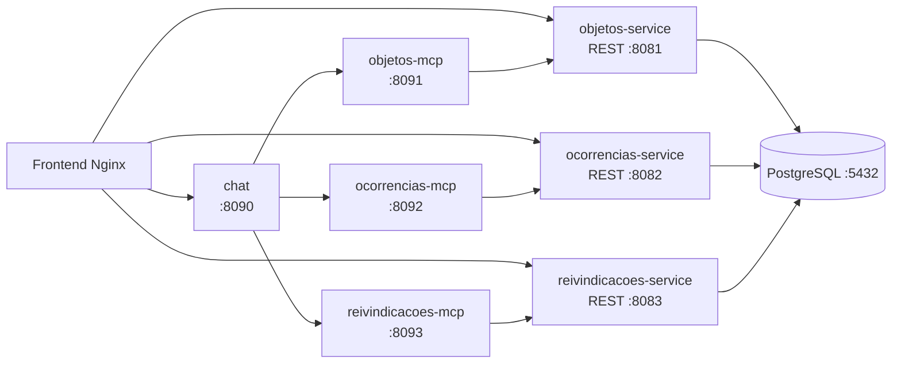

# Achados e Perdidos — IFBA

Sistema distribuído para registro e consulta de objetos perdidos ou encontrados, desenvolvido para a disciplina **Desenvolvimento de Aplicações Orientadas a Serviços** da pós-graduação em Desenvolvimento Web do IFBA.

A solução combina APIs REST, um cliente web resiliente, servidores MCP e um chat com IA capaz de consultar os serviços por meio do **Model Context Protocol (MCP)**.

> Este README documenta a estrutura e a execução do código atualmente presente no repositório.

## Visão geral

O sistema é organizado em três domínios:

- **Objetos:** cadastro e consulta das características dos itens.
- **Ocorrências:** registro de objetos perdidos ou encontrados.
- **Reivindicações:** solicitação de devolução e comprovação de propriedade.

Além das APIs REST, o projeto possui:

- um frontend estático servido pelo Nginx;
- um dashboard que consulta os três serviços de forma independente;
- um chat integrado ao Google Gemini por Spring AI;
- três servidores MCP, um para cada domínio;
- PostgreSQL com um schema separado para cada serviço.

## Arquitetura



O frontend usa `Promise.allSettled()` para carregar objetos, ocorrências e reivindicações separadamente. Assim, a indisponibilidade de uma API não impede a visualização das demais áreas do dashboard.

## Estrutura do repositório

```text
.
├── objetos-service/          # API REST de objetos
├── ocorrencias-service/      # API REST de ocorrências
├── reivindicacoes-service/   # API REST de reivindicações
├── objetos-mcp/              # Servidor MCP do domínio de objetos
├── ocorrencias-mcp/          # Servidor MCP do domínio de ocorrências
├── reivindicacoes-mcp/       # Servidor MCP do domínio de reivindicações
├── chat/                     # Chat Spring Boot + Google Gemini + MCP Client
├── frontend/                 # HTML, CSS e JavaScript do cliente web
├── embedding/                # Configuração de dimensões de modelos de embedding
├── achadosperdidos.sql       # Criação dos schemas do PostgreSQL
├── docker-compose.yml        # Orquestração de toda a solução
└── README.md
```

## Tecnologias

- Java 25
- Spring Boot 4.1.1
- Spring AI 2.0.1
- Spring Web MVC
- Spring Data JPA
- PostgreSQL
- Maven
- Docker e Docker Compose
- HTML, CSS, JavaScript e Nginx
- Google Gemini via Spring AI
- Model Context Protocol (MCP)
- Lombok

## Portas e serviços

| Serviço | Descrição | Porta |
|---|---|---:|
| `postgresql` | Banco de dados PostgreSQL | `5432` |
| `objetos-service` | API REST de objetos | `8081` |
| `ocorrencias-service` | API REST de ocorrências | `8082` |
| `reivindicacoes-service` | API REST de reivindicações | `8083` |
| `chat` | API do chat com IA | `8090` |
| `objetos-mcp` | MCP de objetos | `8091` |
| `ocorrencias-mcp` | MCP de ocorrências | `8092` |
| `reivindicacoes-mcp` | MCP de reivindicações | `8093` |
| `frontend` | Cliente web servido pelo Nginx | `3000` |

## Pré-requisitos

Para executar a aplicação completa, instale:

- Docker Engine;
- Docker Compose;
- Git.

O Java 25 e o Maven são necessários apenas para executar ou compilar os módulos individualmente fora dos contêineres.

## Configuração da chave da IA

O serviço `chat` utiliza a variável `GOOGLE_API_KEY`. Crie um arquivo `.env` na raiz do projeto:

```dotenv
GOOGLE_API_KEY=sua-chave-do-google-gemini
```

A chave não deve ser adicionada ao Git. O Compose encaminha essa variável para o contêiner do chat.

## Executando com Docker Compose

Na raiz do repositório, execute:

```bash
docker compose up -d --build
```

O Compose irá:

1. iniciar o PostgreSQL;
2. executar `achadosperdidos.sql`, criando os schemas `objetos_service`, `ocorrencias_service` e `reivindicacoes_service`;
3. iniciar as três APIs REST;
4. iniciar os três servidores MCP;
5. iniciar o chat com IA;
6. publicar o frontend na porta `3000`.

Acesse:

- **Aplicação web:** http://localhost:3000
- **API de objetos:** http://localhost:8081
- **API de ocorrências:** http://localhost:8082
- **API de reivindicações:** http://localhost:8083
- **Chat:** http://localhost:8090

Para acompanhar os logs:

```bash
docker compose logs -f
```

Para verificar o estado dos contêineres:

```bash
docker compose ps
```

Para interromper a aplicação:

```bash
docker compose down
```

Para remover também os dados persistidos do PostgreSQL:

```bash
docker compose down -v
```

> O último comando apaga o volume `achadosperdidos_pg_data` e todos os dados locais do banco.

## APIs REST

As APIs são aplicações Spring Boot independentes, cada uma com seu próprio `pom.xml`, `Dockerfile` e configuração de persistência.

### Objetos

Base URL: `http://localhost:8081`

O frontend utiliza o recurso `/objetos` para:

- listar objetos (`GET /objetos`);
- localizar um objeto por características;
- cadastrar um objeto (`POST /objetos`).

### Ocorrências

Base URL: `http://localhost:8082`

O frontend utiliza o recurso `/ocorrencias` para:

- listar ocorrências (`GET /ocorrencias`);
- registrar uma ocorrência (`POST /ocorrencias`);
- associar a ocorrência a um objeto e informar tipo, localização, data, observações e contato.

### Reivindicações

Base URL: `http://localhost:8083`

O frontend utiliza o recurso `/reivindicacoes` para:

- listar reivindicações (`GET /reivindicacoes`);
- registrar uma solicitação (`POST /reivindicacoes`);
- associar a solicitação a uma ocorrência, ao solicitante e à comprovação apresentada.

Para consultar todos os endpoints implementados em cada API, consulte os controllers dentro dos respectivos módulos.

## Frontend

O frontend está em `frontend/` e é composto por HTML, CSS e JavaScript puro. Ele oferece:

- dashboard com o estado dos três serviços;
- cadastro de objetos e ocorrências;
- cadastro de reivindicações;
- chat integrado;
- tratamento independente de falhas das APIs.

O Nginx publica os arquivos estáticos na porta `80` do contêiner, mapeada para `http://localhost:3000` pelo Compose.

## Chat e MCP

O módulo `chat` é uma aplicação Spring Boot que utiliza:

- `spring-ai-starter-model-google-genai` para o modelo Gemini;
- `spring-ai-starter-mcp-client` para consumir os servidores MCP;
- Spring Web MVC para expor a API utilizada pelo frontend.

Os servidores MCP ficam nos módulos `objetos-mcp`, `ocorrencias-mcp` e `reivindicacoes-mcp`. Cada um encapsula o acesso ao serviço REST correspondente, permitindo que o chat consulte os dados dos três domínios por ferramentas MCP.

## Persistência

O projeto utiliza um único banco PostgreSQL, com schemas separados:

```text
achadosperdidos
├── objetos_service
├── ocorrencias_service
└── reivindicacoes_service
```

As APIs acessam o banco com o usuário `admin`, configurado no `docker-compose.yml`. O script `achadosperdidos.sql` é executado na inicialização do banco e cria os schemas necessários.

## Executando um módulo individualmente

Entre no diretório do módulo desejado e execute:

```bash
./mvnw spring-boot:run
```

No Windows, utilize:

```powershell
.\mvnw.cmd spring-boot:run
```

Exemplo para a API de objetos:

```bash
cd objetos-service
./mvnw spring-boot:run
```

Ao executar fora do Docker, configure uma instância PostgreSQL acessível e as propriedades de conexão esperadas pela aplicação. Para testar a solução completa, prefira o `docker compose`, pois ele configura automaticamente a rede e as URLs internas entre os serviços.

## Testando a solução

Com os contêineres em execução, é possível testar as APIs com o frontend ou com `curl`. Exemplos de consulta:

```bash
curl http://localhost:8081/objetos
curl http://localhost:8082/ocorrencias
curl http://localhost:8083/reivindicacoes
```

Para demonstrar a resiliência do dashboard, pare um dos serviços:

```bash
docker compose stop ocorrencias-service
```

A área de ocorrências deverá indicar indisponibilidade, enquanto objetos e reivindicações continuam sendo carregados de forma independente. Para restaurar o serviço:

```bash
docker compose start ocorrencias-service
```

## Observações de desenvolvimento

- Não versione chaves de API, senhas reais ou arquivos `.env`.
- As URLs `localhost` usadas pelo frontend são adequadas para o acesso pelo navegador; a comunicação entre contêineres usa os nomes dos serviços Docker.
- As aplicações REST usam PostgreSQL e JPA para persistência.
- Os módulos MCP não possuem banco próprio: eles encaminham as consultas para as APIs REST correspondentes.

## Contexto acadêmico

Projeto desenvolvido por **Gui Rezende** para a disciplina **Desenvolvimento de Aplicações Orientadas a Serviços**, do curso de Pós-Graduação em Desenvolvimento Web do IFBA.
