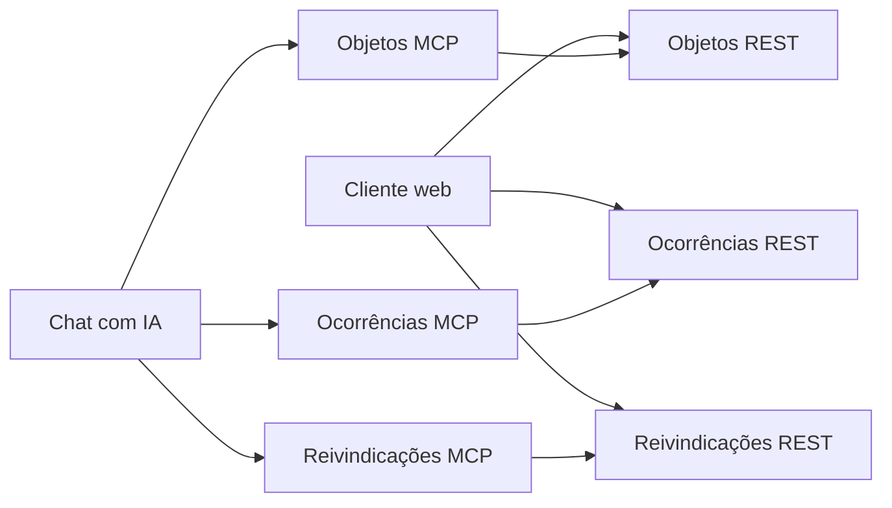

# Achados e Perdidos - IFBA

Projeto acadêmico desenvolvido para a disciplina **Desenvolvimento de Aplicações Orientadas a Serviços** do IFBA.

O sistema permite registrar e consultar objetos perdidos ou encontrados no campus, acompanhar ocorrências e controlar solicitações de recuperação e devolução. A solução é composta por APIs REST conteinerizadas, cliente web resiliente, servidores MCP e um chat integrado a um modelo de IA.

## 1. Objetivos

- Criar três serviços web REST independentes.
- Executar cada serviço em seu próprio contêiner Docker.
- Criar um cliente web que consuma todos os serviços.
- Manter o cliente funcionando quando um dos serviços estiver indisponível.
- Criar um servidor MCP correspondente para cada serviço REST.
- Expor pelo menos dois endpoints de cada serviço por meio de ferramentas MCP.
- Integrar as ferramentas MCP a um chat com OpenAI ou Google AI.

## 2. Escopo definitivo

O projeto possui três domínios principais:

1. **Objetos:** características físicas dos itens.
2. **Ocorrências:** registro de onde e quando um item foi perdido ou encontrado.
3. **Reivindicações:** solicitação, análise e conclusão da devolução ao possível proprietário.

Locais não serão um serviço separado. O local será armazenado na ocorrência. Também não haverá cadastro completo de usuários na primeira versão; os dados mínimos do solicitante ficarão na reivindicação.

## 3. Arquitetura



Cada aplicação terá seu próprio `pom.xml`, processo e contêiner. Todas permanecerão no mesmo repositório.

## 4. Estrutura do repositório

```text
achadosperdidos/
├── objetos-service/
├── ocorrencias-service/
├── reivindicacoes-service/
├── objetos-mcp/
├── ocorrencias-mcp/
├── reivindicacoes-mcp/
├── frontend/                 # será criado posteriormente
├── chat/                     # será criado posteriormente
├── database/                 # scripts de inicialização
├── docker-compose.yml        # será criado posteriormente
├── .env.example
├── .gitignore
└── README.md
```

## 5. Tecnologias

- Java 21
- Spring Boot
- Spring Web MVC
- Spring Data JPA
- Jakarta Validation
- PostgreSQL
- Maven
- Docker e Docker Compose
- Spring Boot Actuator
- Spring AI MCP
- HTML, CSS e JavaScript no cliente web
- OpenAI ou Google AI no chat

## 6. Portas planejadas

| Aplicação | Porta local |
|---|---:|
| `objetos-service` | 8081 |
| `ocorrencias-service` | 8082 |
| `reivindicacoes-service` | 8083 |
| `objetos-mcp` | 8101 |
| `ocorrencias-mcp` | 8102 |
| `reivindicacoes-mcp` | 8103 |
| `chat` | 8090 |
| `frontend` | 3000 |
| PostgreSQL | 5432 |

## 7. Serviços REST

### 7.1. Objetos

Responsável somente pelas características do objeto.

Campos iniciais:

| Campo | Tipo | Obrigatório | Exemplo |
|---|---|---:|---|
| `id` | `Long` | gerado | `10` |
| `nome` | `String` | sim | `Mochila` |
| `categoria` | `CategoriaObjeto` | sim | `ACESSORIO` |
| `cor` | `String` | sim | `Preta` |
| `marca` | `String` | não | `Dell` |
| `descricao` | `String` | sim | `Mochila com dois compartimentos` |
| `caracteristicas` | `String` | não | `Possui um chaveiro azul` |

Endpoints planejados:

| Método | Rota | Finalidade |
|---|---|---|
| `POST` | `/objetos` | Cadastrar objeto |
| `GET` | `/objetos` | Listar objetos |
| `GET` | `/objetos/{id}` | Buscar por identificador |
| `GET` | `/objetos?categoria={categoria}` | Filtrar por categoria |
| `PUT` | `/objetos/{id}` | Atualizar objeto |

Exemplo:

```json
{
  "nome": "Mochila",
  "categoria": "ACESSORIO",
  "cor": "Preta",
  "marca": "Dell",
  "descricao": "Mochila com dois compartimentos",
  "caracteristicas": "Possui um chaveiro azul"
}
```

### 7.2. Ocorrências

Responsável por registrar a perda ou localização de um objeto.

Campos iniciais:

| Campo | Tipo | Obrigatório | Exemplo |
|---|---|---:|---|
| `id` | `Long` | gerado | `20` |
| `objetoId` | `Long` | sim | `10` |
| `tipo` | `TipoOcorrencia` | sim | `ENCONTRADO` |
| `data` | `LocalDate` | sim | `2026-09-07` |
| `local` | `String` | sim | `Laboratório 3` |
| `observacoes` | `String` | não | `Próximo ao computador 15` |
| `status` | `StatusOcorrencia` | sim | `ATIVA` |

Tipos:

```text
PERDIDO
ENCONTRADO
```

Status:

```text
ATIVA
RESOLVIDA
CANCELADA
```

Endpoints planejados:

| Método | Rota | Finalidade |
|---|---|---|
| `POST` | `/ocorrencias` | Registrar ocorrência |
| `GET` | `/ocorrencias` | Listar ocorrências |
| `GET` | `/ocorrencias/{id}` | Buscar por identificador |
| `GET` | `/ocorrencias?tipo={tipo}` | Filtrar por tipo |
| `GET` | `/ocorrencias?status={status}` | Filtrar por status |
| `PATCH` | `/ocorrencias/{id}/status` | Alterar status |

Exemplo:

```json
{
  "objetoId": 10,
  "tipo": "ENCONTRADO",
  "data": "2026-09-07",
  "local": "Laboratório 3",
  "observacoes": "Encontrado próximo ao computador 15",
  "status": "ATIVA"
}
```

### 7.3. Reivindicações

Responsável por registrar e acompanhar a solicitação de recuperação de um objeto.

Campos iniciais:

| Campo | Tipo | Obrigatório | Exemplo |
|---|---|---:|---|
| `id` | `Long` | gerado | `30` |
| `ocorrenciaId` | `Long` | sim | `20` |
| `nomeSolicitante` | `String` | sim | `Guilherme` |
| `email` | `String` | sim | `usuario@ifba.edu.br` |
| `comprovacao` | `String` | sim | `A mochila possui um chaveiro azul` |
| `status` | `StatusReivindicacao` | sim | `PENDENTE` |
| `dataSolicitacao` | `LocalDateTime` | gerado | `2026-09-07T20:00:00` |
| `dataDevolucao` | `LocalDateTime` | não | `null` |

Status:

```text
PENDENTE
APROVADA
REJEITADA
DEVOLVIDA
```

Endpoints planejados:

| Método | Rota | Finalidade |
|---|---|---|
| `POST` | `/reivindicacoes` | Criar solicitação |
| `GET` | `/reivindicacoes` | Listar solicitações |
| `GET` | `/reivindicacoes/{id}` | Buscar por identificador |
| `GET` | `/reivindicacoes?status={status}` | Filtrar por status |
| `PATCH` | `/reivindicacoes/{id}/aprovar` | Aprovar solicitação |
| `PATCH` | `/reivindicacoes/{id}/rejeitar` | Rejeitar solicitação |
| `PATCH` | `/reivindicacoes/{id}/devolver` | Confirmar devolução |

Exemplo:

```json
{
  "ocorrenciaId": 20,
  "nomeSolicitante": "Guilherme",
  "email": "usuario@ifba.edu.br",
  "comprovacao": "A mochila possui um chaveiro azul"
}
```

## 8. Persistência

Para manter o projeto simples e preservar a separação lógica, será usado inicialmente um contêiner PostgreSQL com três bancos:

```text
objetos_db
ocorrencias_db
reivindicacoes_db
```

Cada serviço acessará somente seu próprio banco. Não serão criadas chaves estrangeiras entre bancos; referências entre serviços serão armazenadas como identificadores (`objetoId` e `ocorrenciaId`).

As validações entre domínios poderão ser feitas por chamadas HTTP, sem acesso direto ao banco de outro serviço.

## 9. Dependências

### Serviços REST

Adicionar em cada um dos três serviços:

- Spring Web
- Spring Data JPA
- PostgreSQL Driver
- Validation
- Lombok
- Spring Boot Actuator
- Spring Boot Starter Test

### Servidores MCP

Os MCPs não terão banco de dados. Cada um chamará seu serviço REST correspondente.

Dependências principais:

- Spring AI MCP Server WebMVC
- Spring Boot Actuator
- Spring Boot Starter Test
- Lombok, opcional

Para comunicação remota, utilizar o starter WebMVC e o protocolo `STREAMABLE`:

```xml
<dependency>
    <groupId>org.springframework.ai</groupId>
    <artifactId>spring-ai-starter-mcp-server-webmvc</artifactId>
</dependency>
```

Não usar o transporte SSE antigo. Antes da implementação, conferir se as versões escolhidas de Spring Boot e Spring AI são compatíveis.

### Chat

Se o chat for implementado em Java, ele deverá utilizar:

- Spring AI MCP Client
- starter do provedor escolhido, OpenAI ou Google AI
- Spring Web, caso exponha endpoints para o frontend

Chaves de API nunca devem ser versionadas. Utilizar variáveis de ambiente e manter apenas exemplos em `.env.example`.

## 10. Ferramentas MCP mínimas

Cada MCP precisa acessar pelo menos dois endpoints de seu serviço REST correspondente.

### Objetos MCP

| Ferramenta | Endpoint REST |
|---|---|
| `listar_objetos` | `GET /objetos` |
| `buscar_objeto_por_id` | `GET /objetos/{id}` |
| `buscar_objetos_por_categoria` | `GET /objetos?categoria={categoria}` |

### Ocorrências MCP

| Ferramenta | Endpoint REST |
|---|---|
| `listar_ocorrencias` | `GET /ocorrencias` |
| `buscar_ocorrencia_por_id` | `GET /ocorrencias/{id}` |
| `listar_ocorrencias_ativas` | `GET /ocorrencias?status=ATIVA` |

### Reivindicações MCP

| Ferramenta | Endpoint REST |
|---|---|
| `listar_reivindicacoes` | `GET /reivindicacoes` |
| `buscar_reivindicacao_por_id` | `GET /reivindicacoes/{id}` |
| `listar_reivindicacoes_pendentes` | `GET /reivindicacoes?status=PENDENTE` |

Inicialmente, as ferramentas MCP serão somente de consulta. Ferramentas que modificam dados poderão ser adicionadas depois, se houver tempo.

## 11. Cliente web resiliente

O cliente web terá três áreas independentes:

- objetos;
- ocorrências;
- reivindicações.

Regras de resiliência:

1. Fazer uma requisição separada para cada serviço.
2. Não usar uma única operação que falhe quando qualquer serviço estiver fora do ar.
3. Exibir erro somente na área correspondente ao serviço indisponível.
4. Manter as demais áreas funcionando normalmente.
5. Tentar novamente após um intervalo ou por meio de um botão.
6. Quando o serviço retornar, atualizar sua área automaticamente.

Em JavaScript, preferir `Promise.allSettled()` em vez de `Promise.all()` para carregamentos simultâneos independentes.

## 12. Organização interna dos serviços

Estrutura sugerida para cada API REST:

```text
src/main/java/br/edu/ifba/achadosperdidos/<dominio>/
├── controller/
├── dto/
├── entity/
├── exception/
├── repository/
├── service/
└── config/
```

Estrutura sugerida para cada servidor MCP:

```text
src/main/java/br/edu/ifba/achadosperdidos/mcp/<dominio>/
├── client/
├── config/
├── dto/
└── tool/
```

## 13. Padrão de respostas e erros

Respostas esperadas:

| Situação | HTTP |
|---|---:|
| Cadastro realizado | `201 Created` |
| Consulta realizada | `200 OK` |
| Atualização realizada | `200 OK` ou `204 No Content` |
| Recurso inexistente | `404 Not Found` |
| Dados inválidos | `400 Bad Request` |
| Serviço dependente indisponível | `503 Service Unavailable` |

Todas as APIs devem validar entradas e retornar erros em formato consistente.

## 14. Ordem de implementação

### Fase 1 - Fundação

- [ ] Criar `.gitignore` na raiz.
- [ ] Confirmar que cada aplicação possui seu próprio `pom.xml`.
- [ ] Importar os seis projetos Maven no IntelliJ.
- [ ] Definir versões compatíveis de Spring Boot e Spring AI.
- [ ] Definir portas no `application.yml` de cada aplicação.

### Fase 2 - Objetos REST

- [ ] Criar entidade e enum de categoria.
- [ ] Criar DTOs de entrada e saída.
- [ ] Criar repository.
- [ ] Criar service com regras de negócio.
- [ ] Criar controller.
- [ ] Criar tratamento de erros.
- [ ] Validar os dados de entrada.
- [ ] Criar testes.
- [ ] Testar os endpoints no Postman ou `curl`.

### Fase 3 - Ocorrências REST

- [ ] Criar entidade e enums.
- [ ] Implementar endpoints e filtros.
- [ ] Validar referência ao objeto, se aplicável.
- [ ] Criar testes.
- [ ] Testar indisponibilidade do serviço de objetos.

### Fase 4 - Reivindicações REST

- [ ] Criar entidade e enum de status.
- [ ] Implementar transições de status.
- [ ] Impedir transições inválidas.
- [ ] Validar referência à ocorrência, se aplicável.
- [ ] Criar testes.

### Fase 5 - Banco e Docker

- [ ] Criar script para os três bancos.
- [ ] Criar um `Dockerfile` por aplicação.
- [ ] Criar `docker-compose.yml` na raiz.
- [ ] Configurar rede interna do Docker.
- [ ] Configurar variáveis de ambiente.
- [ ] Adicionar health checks.
- [ ] Subir toda a solução com `docker compose up -d --build`.

### Fase 6 - Cliente web

- [ ] Criar as três áreas do dashboard.
- [ ] Consumir os três serviços.
- [ ] Implementar tratamento independente de erros.
- [ ] Implementar tentativa automática de reconexão.
- [ ] Demonstrar um serviço parado e os demais ativos.

### Fase 7 - Servidores MCP

- [ ] Configurar Streamable HTTP.
- [ ] Implementar `objetos-mcp`.
- [ ] Implementar `ocorrencias-mcp`.
- [ ] Implementar `reivindicacoes-mcp`.
- [ ] Garantir pelo menos duas ferramentas por MCP.
- [ ] Testar todos os MCPs com o MCP Inspector.

### Fase 8 - Chat com IA

- [ ] Escolher OpenAI ou Google AI.
- [ ] Configurar o cliente MCP.
- [ ] Conectar os três MCPs.
- [ ] Disponibilizar as ferramentas para o modelo.
- [ ] Criar interface simples para o chat.
- [ ] Testar perguntas que usem mais de um serviço.

### Fase 9 - Entrega

- [ ] Revisar o código e remover segredos.
- [ ] Atualizar instruções de execução.
- [ ] Preparar dados de demonstração.
- [ ] Ensaiar apresentação com duração inferior a sete minutos.
- [ ] Gravar vídeo com imagem e som adequados.
- [ ] Confirmar que todos os arquivos necessários estão no repositório.

## 15. Plano sugerido de commits

```text
docs: adiciona documentação inicial do projeto
feat(objetos): implementa cadastro e consulta de objetos
test(objetos): adiciona testes do serviço de objetos
feat(ocorrencias): implementa gerenciamento de ocorrências
feat(reivindicacoes): implementa fluxo de reivindicações
build: adiciona dockerfiles dos serviços
build: adiciona orquestração com docker compose
feat(frontend): adiciona cliente web resiliente
feat(mcp): adiciona ferramentas MCP de objetos
feat(mcp): adiciona ferramentas MCP de ocorrências
feat(mcp): adiciona ferramentas MCP de reivindicações
feat(chat): integra chat com servidores MCP
docs: adiciona instruções de execução e apresentação
```

## 16. Critérios de conclusão

O projeto estará pronto quando:

- os três serviços REST estiverem funcionando em contêineres separados;
- cada API possuir pelo menos os endpoints previstos;
- o cliente web continuar utilizável quando um serviço for interrompido;
- cada serviço REST tiver um MCP correspondente;
- cada MCP acessar pelo menos dois endpoints REST;
- o chat disponibilizar as ferramentas dos três MCPs para o modelo;
- a solução puder ser iniciada seguindo somente as instruções deste README;
- nenhuma chave, senha real ou arquivo sensível estiver versionado;
- o vídeo demonstrar inicialização, cliente resiliente, MCPs e chat.

## 17. Próximo passo

O próximo passo é implementar completamente o `objetos-service` antes de avançar para os demais projetos.

Sequência imediata:

1. revisar `objetos-service/pom.xml`;
2. configurar porta e conexão com PostgreSQL;
3. criar `CategoriaObjeto` e `Objeto`;
4. criar DTOs, repository, service e controller;
5. implementar validações e tratamento de erros;
6. testar todos os endpoints;
7. criar o primeiro `Dockerfile`.

## Referências

- [Spring Initializr](https://start.spring.io/)
- [Spring Boot](https://docs.spring.io/spring-boot/)
- [Spring AI MCP](https://docs.spring.io/spring-ai/reference/api/mcp/mcp-overview.html)
- [MCP Java SDK](https://java.sdk.modelcontextprotocol.io/)
- [Model Context Protocol](https://modelcontextprotocol.io/)

